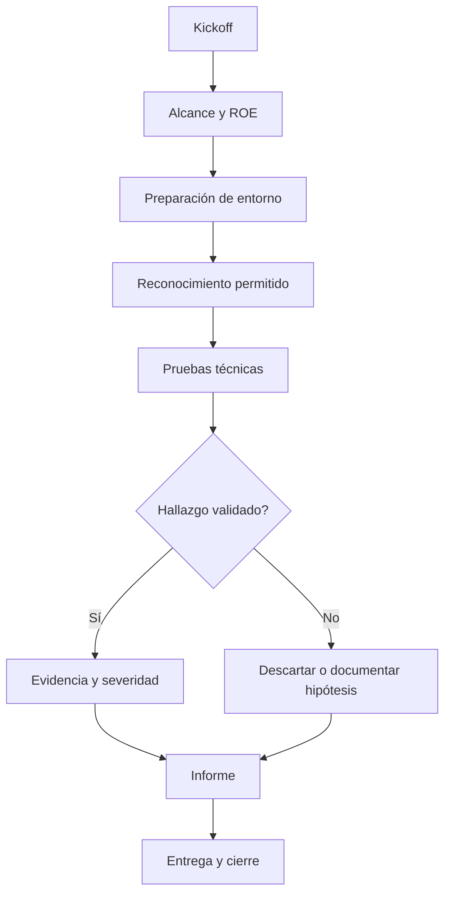

# Flujo para cliente autorizado

## Precondiciones

- Contrato o permiso escrito.
- Alcance firmado.
- Contacto de emergencia.
- Ventana de pruebas.
- Reglas de engagement.

## Flujo operativo

## Datos que nunca deben subirse al repo

- Credenciales reales.
- Datos personales.
- Dumps de bases de datos.
- PCAPs de cliente.
- Capturas con información sensible.
- Informes privados finales.

Usar un repositorio/almacenamiento privado del cliente o gestor documental autorizado.
