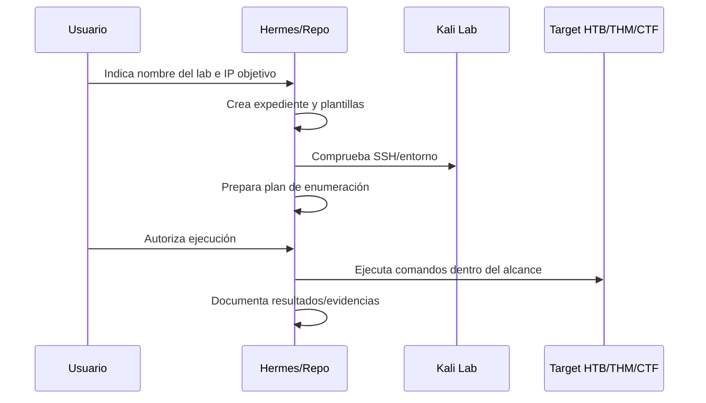

# Flujo de laboratorio HTB/THM/CTF

## Objetivo

Estandarizar el trabajo en laboratorios autorizados sin mezclar datos reales.

## Flujo

## Estados

- `preparacion`: expediente creado, sin escaneos.
- `enumeracion`: reconocimiento autorizado en curso.
- `validacion`: hipótesis contrastadas.
- `explotacion_controlada`: solo si el laboratorio lo permite.
- `cierre`: informe, relevo y lecciones aprendidas.

## Normas

- No ejecutar escaneos hasta tener IP objetivo.
- No atacar fuera del entorno del laboratorio.
- Registrar todos los comandos relevantes.
- Guardar credenciales solo si son del laboratorio.
