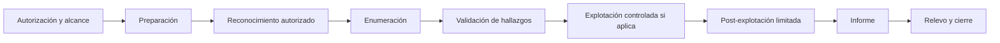

# Metodología de pentesting autorizado

## Principios

- Autorización explícita antes de cualquier acción técnica.
- Alcance documentado: objetivos, fechas, técnicas permitidas y restricciones.
- Mínimo impacto: evitar acciones destructivas o ruidosas si no están aprobadas.
- Trazabilidad: registrar comandos, hora, objetivo y resultado.
- Evidencias reproducibles y protegidas.

## Fases

## Checklist previo

- [ ] Entorno autorizado confirmado.
- [ ] IPs/dominios permitidos definidos.
- [ ] Ventana temporal definida.
- [ ] Técnicas prohibidas identificadas.
- [ ] Evidencias y datos sensibles protegidos.
- [ ] Plan de rollback/contacto definido si aplica.

## Registro mínimo por acción

- Fecha/hora.
- Objetivo.
- Comando o herramienta.
- Motivo.
- Resultado.
- Riesgo observado.
- Evidencia asociada.
