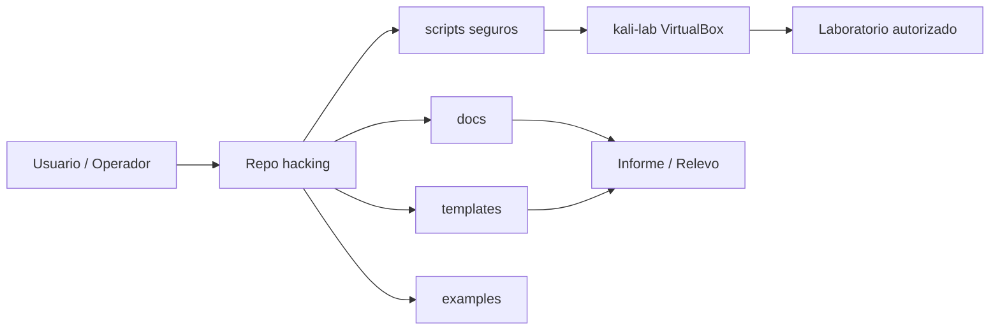

# Arquitectura visual del flujo de trabajo

## Capas

- **Repo:** metodología, plantillas y scripts auxiliares.
- **Kali Lab:** entorno técnico controlado.
- **Laboratorio/cliente:** solo objetivos autorizados.
- **Informe/relevo:** trazabilidad y continuidad.
